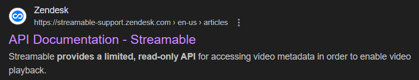

<h1 align="center">
    
    <p>Streamable.py</p>
</h1>
<p align="center">
    <i>
        Unofficial Python wrapper for the undocumented API of <a href="https://streamable.com">streamable.com</a>
    </i>
</p>

A comprehensive Python library for interacting with Streamable.com, enabling video uploads, account management, and various other operations through the undocumented API.

📖 **[Documentation](./DOCS.md)** - Complete API reference

## ✨ Features

-   🎥 **Video Upload**: Upload videos up to 250MB and 10 minutes (free account limits)
-   🔐 **Authentication**: Email + password authentication with session management
-   👤 **Account Management**: Change passwords, player colors, and privacy settings
-   🏷️ **Label Management**: Create, rename, and delete video labels
-   🛡️ **Type Safety**: Full Pydantic models with comprehensive type hints

## 📦 Installation

```bash
# Using pip
pip install streamable-py

# Using uv (recommended)
uv add streamable-py
```

## 🚀 Quick Start

```python
from streamable import StreamableClient, AccountInfo
from pathlib import Path

# Create account credentials
account = AccountInfo(email="your@email.com", password="your_password")

# Upload a video
with StreamableClient() as client:
    client.login(account)
    video = client.upload_video(Path("video.mp4"))
    print(f"Uploaded: {video.url}")
```

## 🔐 Authentication

> [!IMPORTANT]
> This library supports **email + password authentication only**. Google and Facebook login methods are not supported.

```python
from streamable import StreamableClient, AccountInfo

# Login to existing account
account = AccountInfo(email="user@example.com", password="secure_password")
client = StreamableClient()
user_info = client.login(account)
print(f"Logged in as: {user_info.user_name}")

# Or create a new account
new_user = client.signup(account)
print(f"Created account: {new_user.email}")

# Logout or use context manager
client.logout()
```

## 👤 Account Management

```python
with StreamableClient() as client:
    client.login(account)

    # Change password
    client.change_password("new_secure_password")

    # Update player color
    client.change_player_color("#FF6B6B")

    # Modify privacy settings
    client.change_privacy_settings(
        visibility="private",
        allow_download=False,
        hide_view_count=True
    )
```

## ⚠️ Limitations

> [!WARNING]
> All functionality is based on the [**Free plan**](https://streamable.com/pricing) limitations.

-   **File Size**: Maximum 250MB per video
-   **Duration**: Maximum 10 minutes per video
-   **Authentication**: Email + password only (no OAuth)

## 📋 Requirements

-   🐍 Python **3.13+**

## 📄 License

MIT License - see [LICENSE](./LICENSE) file for details.

## 🤝 Contributing

Contributions are welcome! Please feel free to submit issues and pull requests.

## ⚠️ Disclaimer

> The only documented part of the API covers this:
> 

This is an unofficial library that uses undocumented API endpoints. It may break if Streamable.com changes their internal API.
